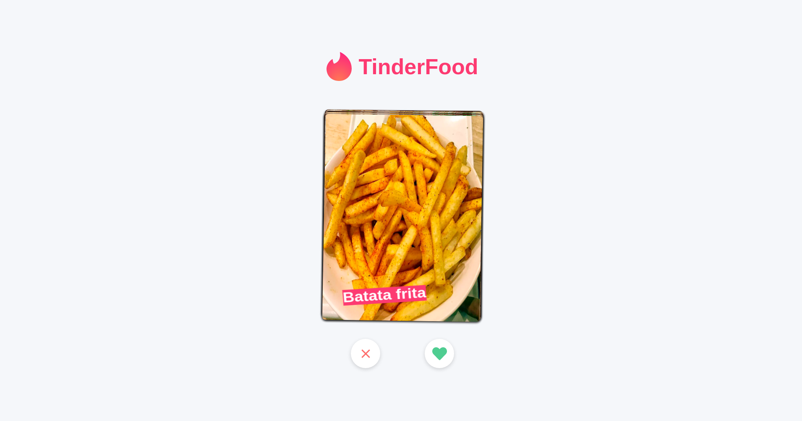

<h1 align="center">TindFood</h1>

### :construction: Em Desenvolvimento.....

### :page_with_curl: About
Tinder de comida, você responderá algumas perguntas e baseado nessas respostas você podera ter o o match com a comida ou não.



### :rocket: Running Locally


```sh
# 1.Instale as dependencias
yarn install

# 4.Execute o servidor de desenvolvimento
yarn start

Runs the app in development mode.<br>
Open [http://localhost:3000](http://localhost:3000) to view it in the browser.
```


---

<p align="center">
Made with ♥ by <a href="https://www.linkedin.com/in/juliano-sirtori">Juliano</a>
</p>